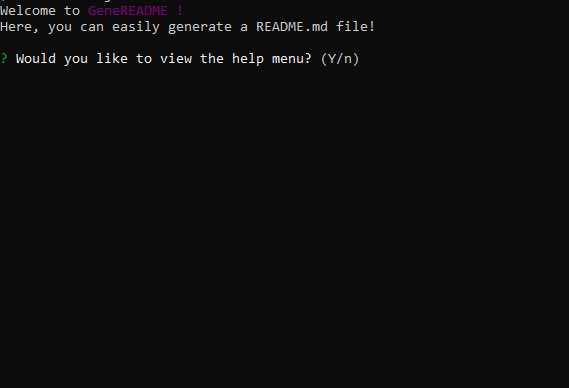
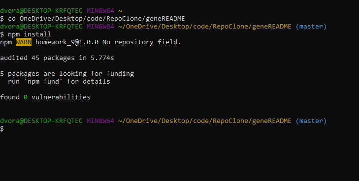
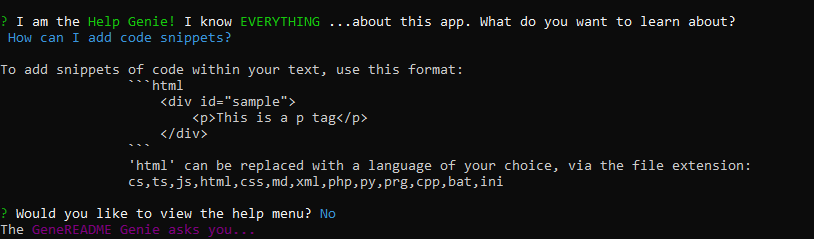

# GeneREADME
  
This project is a node.js file which guides the user through the process of generating a readme, and then saves the resultant markdown file.  A link to the repository can be found [here.](https://github.com/dvorakjt/geneREADME)
## Table of Contents

[Introduction](#introduction)  
[Installation](#installation)  
[Usage](#usage)  
[Tests](#tests)  
[Contributing](#contributing)  
[License](#license)  
[About the Author](#about-the-author)  

## Introduction

  

GeneREADME is a fast (and slightly-more-fun-than-normal) way to build your README's. GeneREADME is a Node.js application, meaning that it is run from the terminal. Once you run the index.js file, intro text will display to the screen. The user will be asked if they would like to be taken to a help menu. For first-time users, this can help prepare them to use the application. If the user elects not to go to the help screen, or if the user is ready to get started writing their README after viewing the help screen, they will be offered successive prompts detailing the contents of the README. Once the user has answered all of the prompts, their README is saved as a Markdown file to the READMES directory.

## Installation

To install GeneREADME, clone this repository. You will need to have node.js installed on your computer. Then enter your terminal and cd into the local repository folder. From there, run npm install to make sure that all dependencies have been installed. One you do this, you should be able to run the index file by entering the command node index.js.

### Dependencies

Axios, Chalk, Inquirer

## Usage

When the user first runs the application, some introductory text will be displayed. From there, the user is able to enter a help menu, or start working. If the user inputs "Y", then they will be taken to a Help menu. To add a little charm to the UX, the user is assisted by two GeneREADME Genies. The Help Genie is a bit of a know-it-all, it seems... The user is able to continuously select different options in the help menu until they are ready to begin working. This is because the Helper.init() and Helper.helpMenu() call each other at different times. For instance, if the user does wish to be taken to a help menu, the Helper.init() method calls Helper.helpMenu(). If they do not, it creates an instance of the Builder class, which is the class responsible for handling the input that the user enters in order to fill in the README. Once the user enters their input, it will be entered into a new instance of the Template class. A new directory is made to house the README for this specific repo, & it is saved

## Tests

So far, I wrote one test using Jest to check that the Template file indeed creates the correct Template.text result given an answers object. I intend to add more tests as I learn to use Jest.

## Contributing

If you notice any errors in the code, please create a Github issue. 

## License
### This project is licensed under an MIT License.

## About the Author

Joe Dvorak

Github: dvorakjt

Github repository: [github.com/dvorakjt](https://github.com/dvorakjt/)

Portfolio: [dvorakjt.github.io/](https://userName.github.io/)

Email: dvorakjt@gmail.com

README generated by GeneREADME. Original template written with [StackEdit](https://stackedit.io/). Badges provided through shields.io.
